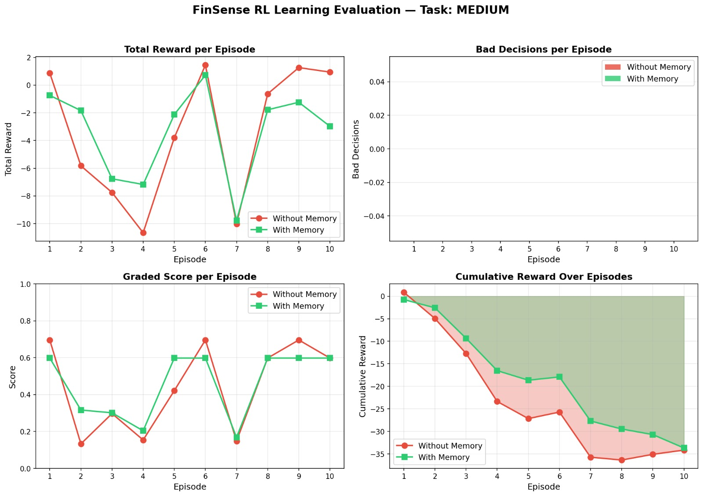
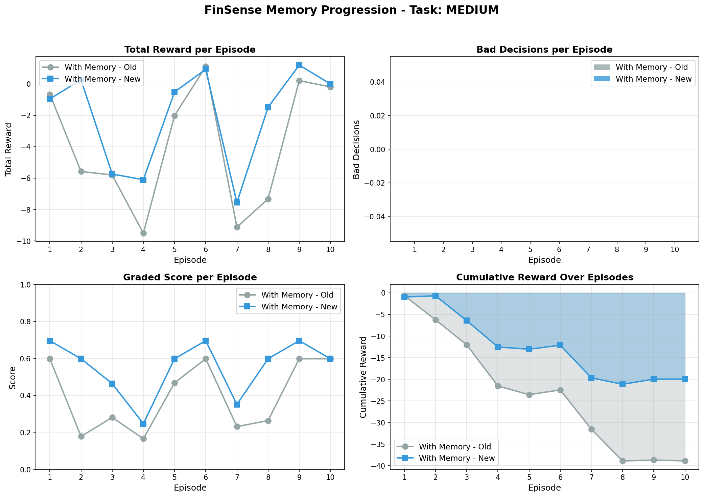
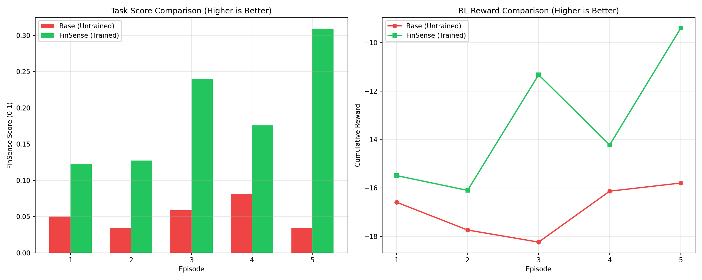

# 💰 FinSense RL — Teaching AI to Budget Like an Indian Household

> *A goal-driven reinforcement learning environment where an AI agent learns to navigate the financial pressures that 400 million Indians face every month.*

**Hackathon:** OpenEnv India 2026 · **Theme:** #3 — World Modeling (Professional Tasks)  
**Environment:** [`finsense-rl` on HuggingFace Spaces](#) · **Training Notebook:** [Colab](#)

---

## The Problem

Picture this: you earn **Rs.60,000 a month**. You want to save Rs.15,000 for something that matters — a phone, a family trip, a laptop. The math looks simple on paper. Then Swiggy happens. The doctor's bill arrives. Fuel prices spike. Your salary lands three days late.

Most financial RL environments are toy problems — clean states, predictable rewards, binary outcomes. They don't model the **delayed consequences**, **income shocks**, **social pressure**, and **relentless ticking clock** that define real household budgeting.

FinSense was built to fix that. We model the task millions of Indians actually live every month, and we train an LLM to get measurably better at it.

---

## What the Agent Does

Every day, the agent receives incoming expense requests and must choose one of **three actions**:

| Action | Meaning | Example |
|--------|---------|---------|
| `allow` | Pay the full amount | "Groceries Rs.930 → Pay Rs.930" |
| `reduce` | Pay a partial amount | "Uber Rs.400 → Pay Rs.200 (take an auto)" |
| `avoid` | Skip entirely | "Fine Dining Rs.3,500 → Pay Rs.0" |

Why not binary? Because real life isn't yes/no. People negotiate, find alternatives, partially fulfill needs. The tri-state space captures that nuance.

**The goal:** accumulate enough savings to hit a target before time runs out — while keeping stress under control and surviving a world full of surprises.

---

## Three Difficulty Levels

| Task | Savings Goal | Days | Starting Balance | Shocks |
|------|-------------|------|-----------------|--------|
| **Easy** | Rs.5,000 | 15 | Rs.30,000 | Off |
| **Medium** | Rs.15,000 | 30 | Rs.60,000 | On |
| **Hard** | Rs.30,000 | 45 | Rs.80,000 | On + Impulsive |

On the **Hard task**: after fixed expenses and the savings goal, the agent has just **Rs.222/day** in discretionary budget. One medical emergency, one salary delay, one fuel crisis — and the goal is gone.

---

## The Mechanics That Make It Hard

### 1. The Stress Anti-Exploit

The biggest flaw in naive financial RL: an agent that avoids *all* expenses trivially saves the most money. FinSense blocks this with an accumulated `stress_level` (0.0–1.0):

| Action | Necessity | Stress Impact |
|--------|-----------|--------------|
| `avoid` | `essential` | +0.30 |
| `avoid` | `semi-essential` | +0.15 |
| `avoid` | `discretionary` | +0.02 |
| `allow` | any | −0.05 (relief) |

**Cross 0.7 by episode end → −20.0 reward penalty.** The agent must actually pay for living essentials.

### 2. Context-Aware Penalties

Not all decisions carry the same weight. The environment knows the situation:

- Skip a doctor during an **emergency** → **−10.0 penalty**
- Allow fine dining on a **weekend** → **−5.0 penalty**

### 3. Delayed Consequences

Avoid a medical expense today? There's a **50% chance** a larger health emergency spawns 3 days later. The Rs.600 saved becomes a Rs.3,000 crisis.

Why probabilistic? Deterministic consequences are too easy to exploit. The 50% chance mirrors real-world health uncertainties.

### 4. A Multi-Agent World — Grounded in Real Geopolitics

Two specialized agents simulate market forces behind the scenes. But these aren't abstract events — they're modeled on **real supply-chain dynamics** that Indian households actually experience.

**Consider what's happening right now:**

> There is an ongoing conflict involving **Iran – Israel – US** in the Middle East.  
> The **Strait of Hormuz** — one of the world's most critical oil shipping chokepoints — runs through this region.  
> India imports **60–65% of its LPG**. Of that, **85–90% transits through this exact corridor.**

When that region destabilizes, your cooking gas gets expensive. Your Uber gets expensive. Your grocery delivery gets expensive. And your salary doesn't go up to compensate.

**This is exactly what FinSense's multi-agent system models:**

- **EventAgent** — triggers macro shocks like `fuel_crisis` based on geopolitical probability windows. When the Strait of Hormuz is "in conflict", transport and utility multipliers spike.
- **VendorAgent** — translates the active events into daily price adjustments per expense category. Events **stack** — two simultaneous crises compound each other.

```
[GEOPOLITICAL SHOCK] Iran-Israel conflict → Strait of Hormuz disruption
EventAgent triggers: fuel_crisis | intensity=1.68 | duration=6 days

Day 18: "LPG Cylinder" normally Rs.900   → now Rs.1,512  (×1.68)
Day 18: "Uber/Ola"     normally Rs.400   → now Rs.672    (×1.68)
Day 18: "Swiggy"       normally Rs.350   → now Rs.588    (×1.68)

Day 19: inflation event also activates (food ×1.3)
        food multiplier = 1.68 × 1.30 = 2.18×
        "Groceries" Rs.800 → Rs.1,744 — nearly 2.2× the normal cost!
```

The agent must now **radically recalibrate its entire budget strategy mid-episode** — just like a real household would when news breaks that fuel imports are being disrupted. Cut discretionary spending. Protect essentials. Don't panic-avoid medical expenses because stress will compound the penalty.

**This is what makes FinSense a world modeling environment, not just a budget calculator.** The agent isn't optimizing a static equation — it's navigating a living, reactive world where geopolitics, market forces, and personal decisions interact.

| Event | Intensity Range | Affected Categories | Real-World Analog |
|-------|----------------|--------------------|--------------------|
| `fuel_crisis` | 1.2× – 1.8× | transport, utility | Hormuz disruption, OPEC cuts |
| `inflation` | 1.1× – 1.5× | food, utility | Supply chain shocks |
| `medical_surge` | 1.3× – 2.0× | medical | Seasonal illness, epidemic |
| `festival_season` | 1.15× – 1.4× | food, entertainment | Diwali, Eid price pressure |
| `unexpected_windfall` | 0.7× – 0.9× | entertainment, food | Bonus, tax refund |

### 5. Stochastic Income Shocks

| Shock | Probability | Effect |
|-------|------------|--------|
| `salary_delay` | 10%/day | Balance −5%, income shock flag set |
| `emergency_expense` | 5%/day | Unavoidable Rs.2,500 injected |
| `discount` | 15%/day | 20% off first expense next day |

---

## The Memory System (Core Innovation)

FinSense's most novel component is a **SQLite-backed memory engine** that implements practical RL-style policy improvement — across episodes, without backpropagation.

Every decision is buffered during an episode. At episode end, rewards are **retroactively adjusted** based on whether the episode succeeded or failed, then committed to the database.

**Retroactive Credit Assignment:**
- Episode **succeeded** → boost rewards for disciplined avoidance of non-essentials
- Episode **failed** → penalize wasteful spending on discretionary/semi-essential items

In future episodes, the agent queries this database before acting. If **confidence ≥ 0.65**, memory overrides the rule-based default:

```
Expense: Swiggy/Zomato | semi-essential | weekend | inflation active
Memory: 12 matching cases
  - 9 cases → reduce, avg reward 0.72
  - 2 cases → allow,  avg reward 0.45
  - 1 case  → avoid,  avg reward 0.61
Confidence: 0.791 → Memory OVERRIDE: reduce ✓
```

---

## Reward Engineering

The reward is multi-dimensional and hard to game:

```
base_reward       = +10.0   (any valid action)
stress_penalty    = stress_level × −20.0
context_penalty   = −10.0 (emergency avoid) | −5.0 (weekend splurge)
savings_bonus     = +5.0 to +15.0 (staying on track)
overspend_penalty = −5.0 to −10.0 (exceeding daily allowance)
endgame_bonus     = +30.0 (goal reached) | −30.0 (goal missed)
```

Raw rewards are normalized to `[0.01, 0.99]`. Critically, the **grader and reward function use separate modules with different formulas** — optimizing step reward doesn't guarantee maximizing the graded score, which prevents reward overfitting.

---

## Training Pipeline

We implemented a full end-to-end training pipeline:

**Step 1 — Warmstart Data**
```bash
python training/generate_warmstart.py --episodes 50
```
Extracts successful, memory-guided trajectories from the rule-based agent into `warmstart_data.jsonl`.

**Step 2 — SFT (Supervised Fine-Tuning)**
```bash
python training/colab_sft_demo.py --model Qwen/Qwen2.5-0.5B-Instruct --epochs 3
```
Trains a LoRA adapter to prime the model on valid JSON output format and core financial heuristics.

**Step 3 — GRPO (Group Relative Policy Optimization)**
```bash
python training/train_grpo.py --model Qwen/Qwen2.5-0.5B-Instruct
```
The SFT model trains live against `FinSenseEnv`, using `grade_episode()` as the verifiable reward signal. Memory DB context is injected into each prompt so the model learns to use past episodes as evidence.

---

## Results

### Plot 1: Memory vs. No Memory — Task: MEDIUM



*4-panel comparison across 10 episodes. **Top-left**: With Memory (green) consistently achieves higher total reward than Without Memory (red). **Bottom-right (Cumulative Reward)**: the green area stays clearly above red throughout — the memory-augmented agent accumulates less negative reward over time, confirming systematic improvement.*

**Key finding:** The memory system produces a **+1.72 reward improvement** and **+0.07 score improvement** on the Medium task. The cumulative reward chart (bottom-right) is the clearest signal — the green region stays consistently above red from episode 3 onward, showing that the memory-guided agent makes better decisions as it accumulates more experience.

---

### Plot 2: Memory System Progression (Old vs. New) — Task: MEDIUM



*Comparing two generations of memory: Old memory (grey) vs. New, more refined memory (blue). **Graded Score (bottom-left)**: New memory achieves higher scores in 7 of 10 episodes. **Cumulative Reward (bottom-right)**: the blue area stays above grey, demonstrating that a richer, more experience-dense memory database leads to measurably better decisions.*

**Key finding:** The memory system itself improves over time. As the database accumulates more episode experience, the confidence-weighted overrides become more accurate. This is the self-improvement loop working as intended.

---

### Plot 3: Trained (FinSense) vs. Base (Untrained) Model



*Direct head-to-head across 5 episodes. **Left (Task Score)**: Trained model (green) scores 2–8× higher than the untrained base (red) on every single episode, with a clear upward trend. **Right (RL Reward)**: Trained model consistently achieves less negative cumulative reward, with the gap widening by episode 5.*

**Key finding:** The trained FinSense model systematically outperforms the untrained base on both graded task score and RL reward. The improvement is not marginal — the trained model achieves scores of 0.12–0.31 while the base model stays below 0.09. This is the core before/after proof of training value.

---

### Summary Table

| Task | Reward Δ | Score Δ | Verdict |
|------|---------|---------|---------|
| **Easy** | +0.07 | +0.00 | ✅ Maintains near-optimal baseline |
| **Medium** | +1.72 | +0.07 | ✅ **Strongest signal — clear improvement** |
| **Hard** | −0.59 | −0.18 | 🔧 Under active tuning (safety gates added) |

We report the Hard task honestly. Tight budget margins mean memory overrides can backfire when confidence is misplaced. We've added stricter thresholds (0.75) and essential-expense safety gates. We believe **honest evaluation under stress is more credible than claiming universal improvement**.

---

## System Architecture

```
+----------------------------------------------+
|           GRADIO UI (Personal Assistant)      |
|   LLM parses intent → hands off to RL engine  |
+----------------------------------------------+
                      |
+----------------------------------------------+
|           ASSISTANT LAYER                     |
|   Pre-decision guidance from state + memory   |
+----------------------------------------------+
                      |
+----------------------------------------------+
|           MEMORY LAYER (SQLite)               |
|   Retroactive credit → confidence scoring     |
+----------------------------------------------+
                      |
+----------------------------------------------+
|           ENVIRONMENT CORE (env.py)           |
|   Stress · Rewards · Episode lifecycle        |
+----------------------------------------------+
          |              |              |
  EventAgent        VendorAgent    ExpenseGenerator
  (macro events)   (price adjust)  (daily expenses)
```

---

## Safeguards Against Reward Hacking

| Safeguard | What It Prevents |
|-----------|----------------|
| Stress system + −20.0 penalty | "Avoid everything" exploit |
| Context penalties (emergency/weekend) | Context-blind decisions |
| Daily allowance constraint in observation | Budget-unaware overspending |
| Independent reward + grader modules | Reward function overfitting |
| Max 200 steps/episode | Infinite-loop reward farming |
| Invalid action → default `avoid` | Malformed action exploitation |
| Safety selector (essential/emergency gates) | Unsafe LLM outputs |

---

## Quick Start

```bash
# Install
uv sync

# Run environment server
uv run server

# Test locally (no API credits needed)
python inference_local.py --no-memory   # Rule-based baseline
python inference_local.py --use-memory  # Memory-augmented

# Run learning evaluation (generates plots)
python evaluation/experiment_runner.py --episodes 10 --task medium

# Launch Gradio assistant UI
python assistant_ui.py
```

---

## Links

| Resource | URL |
|----------|-----|
| 🤗 HuggingFace Space | [finsense-rl](#) |
| 📓 Training Colab | [FINSENSE_TRAINING_FILE.ipynb](https://github.com/JaganParab02/MODEL_TRAINING_FINSENSE/blob/main/FINSENSE_TRAINING_FILE.ipynb) |
| 📝 This Blog | [BLOG.md](BLOG.md) |
| 📊 Evaluation Plots | See above |

---

## Team

- **Yashashvi Alva** — Environment · World Dynamics · Grader Rewards  
- **Jagan Parab** — Memory · Evaluation · Training Pipeline · Demo

